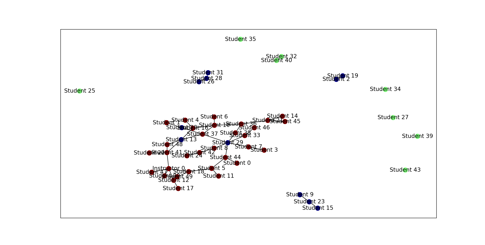

# misinformed-graphs
A simple simulation of how misinformation might spread in a classroom. The simulation begins with an instructor with correct information they want to spread to the whole class. Only a few of the students in the class pay direct attention to the instructor so the information is not spread out immediately.

As the simulation progresses, students have a small probability of generating misinformation (perhaps they misread the email their professor sent out or confused themselves) which may spread to other students. The rates at which misinformation is generated and spread can be tweaked in the program.

The simulation represents Instructors and Students as vertices in an undirected graph. In the code, Instructors and Students are subclasses of the Node class. Each Node has some number of connections to other Nodes over which they spread information. The rates at which misinformation is generated and spread are class attributes that can be tweaked when the simulation is begun.

Nodes drawn in red, blue, and green have correct, incorrect, and no information, respectively.

Before Simulation            |  After Simulation
:-------------------------:|:-------------------------:
  |  

## Running the simulation
To run the code, first clone the code onto your machine. Then,

`pip install -r requirements.txt`

installs all the required packages (the important ones are matplotlib and networkx). To run the simulation,

`python graph_evolve.py`

You will be asked to input a few values, including

* `n_students`: number of students in the class
* `nisc`: number of connections (edges) between students and the instructor
* `nssc`: number of connections (edges) between students
* `timesteps`: number of timesteps in simulation
* `persuasion_probability`: how likely a student is believe misinformation from a neighboring student
* `corruption_probability`: how likely a student is to generate misinformation at a given timestep

You can just press enter to use default values. The code will then generate and display a plot of the graph representing the class. After closing this plot, a second plot of the graph after the simulation is displayed.
